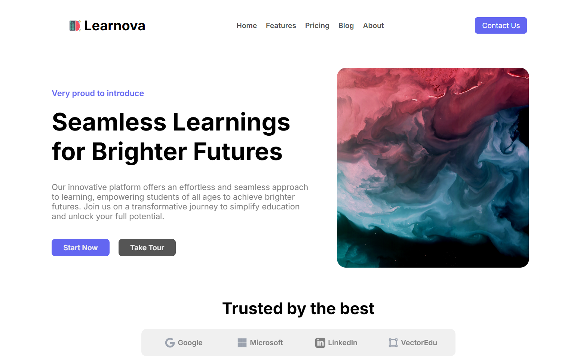
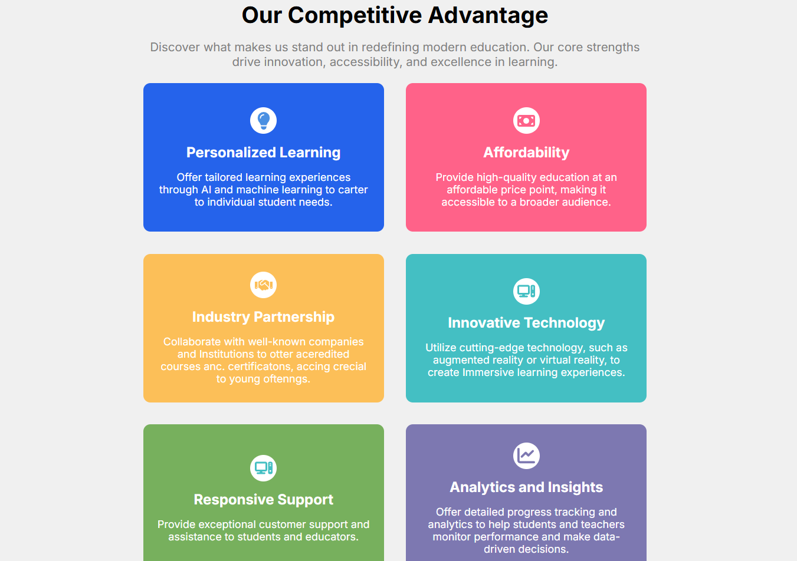
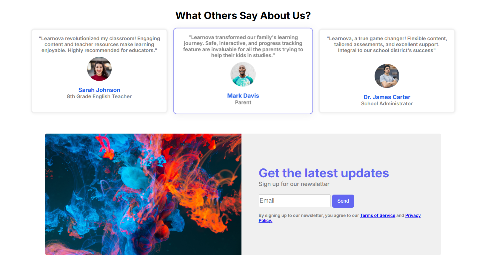
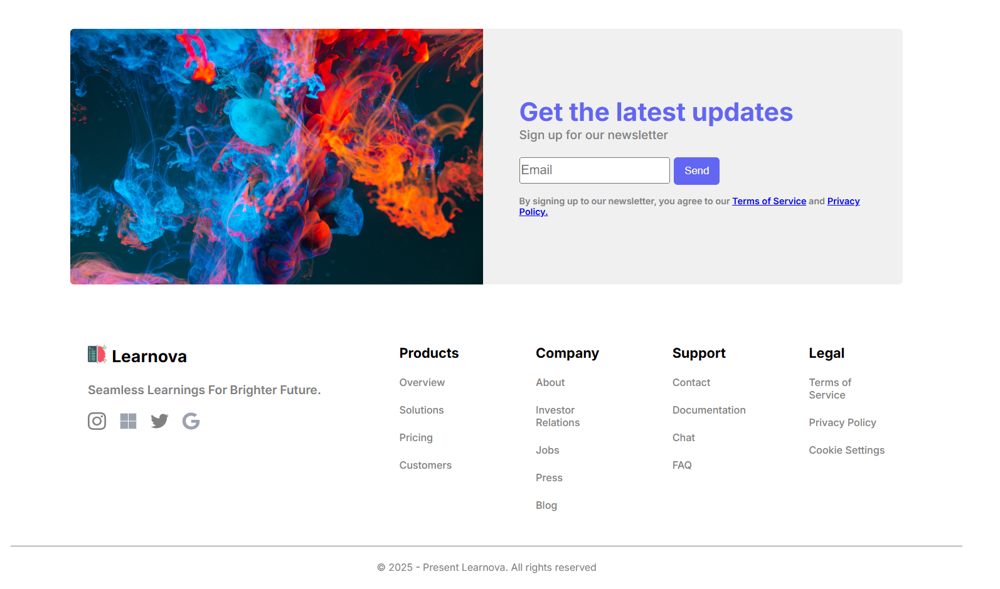

# Learnova

### Live Site: [https://learnova-k1.vercel.app/](https://learnova-k1.vercel.app/)  
---

## Overview
Learnova is a responsive educational website built using **HTML** and **CSS**.  
It is designed to present an online learning platform that promotes accessibility, innovation, and personalized education. The project focuses on creating a clean, structured, and user-friendly layout suitable for modern e-learning platforms.

---

## Features
- **Hero Section:** Highlights Learnova’s mission — *“Seamless Learnings for Brighter Futures”* — with clear call-to-action buttons.  
- **Competitive Advantage:** Organized grid of cards showcasing Learnova’s strengths:
  - Personalized Learning  
  - Affordability  
  - Industry Partnership  
  - Innovative Technology  
  - Responsive Support  
  - Analytics and Insights  
- **Testimonials:** Section showing user feedback from teachers, parents, and administrators.  
- **Newsletter:** Email subscription form for updates, with links to Terms of Service and Privacy Policy.

---

## Tech Stack
- **Languages:** HTML5, CSS3  
- **Layout:** Flexbox and Grid  
- **Hosting:** Vercel  

---

## Screenshots
### Top  

### Competitive Advantage  

### Testimonials  

### Footer  

---
